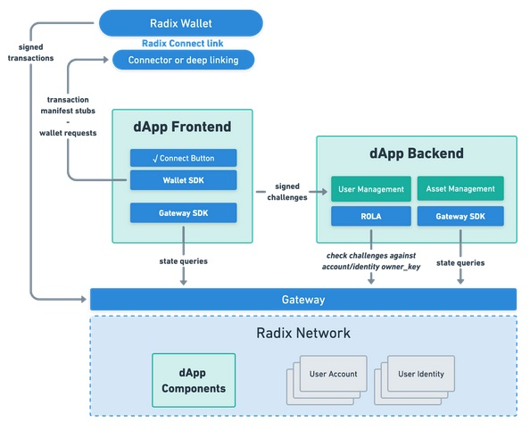

<!-- markdownlint-disable MD033 -->

<style>
    .titulo {
        text-align: center;
    }
</style>

<h1 style="text-align: center;"> Programação de Dapps com Scrypto</h1>

<h2 style="text-align: center;">Grupo de Estudos Para Iniciantes</h2>

<h3 style="text-align: center;">Radix Brasil</h3>

<h4 style="text-align: center;">@magal36</h4>

---

#### O que esperar da nossa interação?

- Isto aqui não é um curso. Não sou professor nem profissional da área.
- O que farei a princípio nada mais é do que abordar os conceitos mais básicos com vocês, mas em algum momento vamos esbarrar nas minhas limitações de conhecimento, deste ponto em diante podemos seguir o aprendizado juntos.
- É uma forma de unir a comunidade, nos ajudarmos mutuamente na disciplina de estudar.

---

#### O que esperar da nossa interação (2)?

- Vou tentar me preparar melhor do que na última vez, mas pode acontecer de contar com certo improviso.
- Isto é um projeto colaborativo. Espero de alguns mais safos no assunto contribuições e sugestões. Abrirei o github do projeto para que vocês possam contribuir.
- O projeto é uma preparação/experiência para um curso de Udemy. Dou minha palavra que quando for monetizar isso, caso haja muitas contribuições, farei uma DAO onde poderemos tokenizar a monetização de forma a todos serem recompensados.

---

##### 1. Conceitos de Programação

###### 1.1 Constantes, Variáveis e Tipos de Dados

**Variáveis e constantes** são os elementos básicos que um programa manipula.

**Constante** é um determinado valor fixo que não se modifica durante a execução de um programa.

Uma **variável** é um **espaço reservado na memória** do computador para armazenar um **tipo de dado** determinado. O conteúdo de uma variável pode ser alterado ao longo do tempo durante a execução de um programa, podendo assumir diferentes valores, mas só  armazenando um valor a cada instante.

---


###### 1.1 Constantes, Variáveis e Tipos de Dados (2)

Partindo de uma analogia, uma ***variável*** *pode ser considerada como uma caixa*, onde o ***tipo de dado*** que pode ser armazenado na variável *é o tamanho da caixa*.

---

##### 1.2 Operadores

Os operadores são meios pelo qual incrementamos, decrementamos, comparamos e avaliamos dados dentro do computador. Temos três tipos de operadores:

• Operadores Aritméticos (+ - * / %)
• Operadores Relacionais (< > <= >= == !=)
• Operadores Lógicos (&& || !)

---

##### 1.3 Lógica de Programação

É a técnica de encadear pensamentos para atingir determinado objetivo.

##### 1.4 Algoritmo

- Sequência lógica finita, clara, precisa e livre de ambiguidades, de passos que levam a execução de uma tarefa.
- Representações:
  - Fluxograma
  - Pseudo-Código

---

##### Fluxograma


---


##### 1.4.1 Sequência

- Esta estrutura é composta por uma sequência enfileirada de instruções, que são executadas uma após a outra.

---


#### 1.4.2 Decisão

- Estruturas de decisão são utilizadas para realizar um controle e um desvio no fluxo das instruções do programa, ou seja, algumas ações somente serão realizadas se uma determinada condição for atendida.

---


#### 1.4.3 Iteração

- Estruturas de iteração (repetição ou laço) são utilizadas para realizar uma mesma instrução diversas vezes.
- A repetição pode ocorrer um número pré-estabelecido de vezes ou quando uma condição for satisfeita.

---

#### 1.4.4 Etapas

A maioria dos Algoritmos é composto de três etapas:

- Inicialização (Entrada)
- Execução (Processamento)
- Finalização (Saída)

---


##### 1.4.5 Exemplo de Algoritmo

$C = (5 * (F - 32)) / 9$

- Entrada: ler a temperatura em Celsius
- Processamento: calcular a temperatura em Farenheit
- Saída: exibir a temperatura em Farenheit

---

Os algoritmos também podem ser descritos em uma linguagem chamada **pseudocódigo**. Este nome é uma alusão à posterior implementação em uma linguagem de programação, ou seja, os algoritmos são "independentes" das linguagens de programação. Ao contrário de uma linguagem de programação, não existe um formalismo rígido de como deve ser escrito o pseudocódigo, deve apenas ser fácil de interpretar. Para isso utilizaremos algumas técnicas:

- Usar somente um verbo por frase; Imaginar que você está desenvolvendo um algoritmo para pessoas comuns; Usar frases curtas e simples; Ser objetivo; Procurar usar palavras que não tenham sentido dúbio

---

##### 1.4.6 Exemplo de Algoritmo (2)

A média final (M<sub>f</sub>) é:

$M_f=(P_1+P_2+P_3+P_4)/4$

Pseudocódigo
• Receba a nota da prova1
• Receba a nota de prova2
• Receba a nota de prova3
• Receba a nota da prova4
• Some todas as notas e divida o resultado por 4
• Mostre o resultado da divisão

---

Repare que embora o algoritmo para executar essa tarefa seja simples, seus passos na sequência lógica são na verdade complexos, e para executá-los, tudo ainda tem que ser desmembrado ainda em instruções elementares.

Temos que ter em mente a existência das camadas de complexidade que estão por baixo de nossos programas.

A primeira coisa que a CPU faz é procurar na BIOS as instruções iniciais para localizar o carregador do sistema operacional, que é de fato um programa que funcioona de interface com o hardware.

---

##### 2.1 Estrutura de um PC


---


##### 2.2 Estrutura tradicional de uma aplicação desktop

- O SO interage com o hardware.
- O software interage com o SO.
- O usuário interage com o software através dos dispositivos de E/S.

---

##### 2.3 Estrutura tradicional de uma aplicação web

- Uma aplicação web se divide em back-end e front-end. O código do front-end é servido para o browser do usuário. O DOM interpreta e renderiza a resposta para o usuário, assim como recebe as entradas dele.


---


- O back-end processa as requisições enviadas por https e gerencia o banco de dados.
- Isto é chamado arquitetura Cliente-Servidor.

---


##### 2.3 Estrutura de um Dapp Radix Front-end puro

- O usuário interage com o Dapp através do Front-End (browser). o Dapp gera os manifestos das transações que o usuário assina na carteira.
- O back-end é o próprio Dapp que roda direto no Radix Engine (máquina virtual)

---

##### 2.4 Dapp Radix Full Stack



Backend centralizado tem duas novas funções:

- Administrar logins para personalizar a experiência do usuário, aproveitando a funcionalidade dos logins de Persona Radix, que permite login sem senha com um clique.

---

##### 2.4 Dapp Radix Full Stack (2)


- Acesso ao Gateway SDK - Se o seu Dapp precisa fazer transações diretamente ao invés de apenas propô-las à carteira Radix para o usuário assinar.

---

#### 3. Linguagens de Programação

Nós falamos o idioma português do Brasil, que assim como as linguagens de programação, possui um **conjunto de símbolos**, as letras do alfabeto, que juntas de diferentes maneiras, formam as palavras. A estrutura de organização delas numa sentença é a **sintaxe**. Tais palavras e frases têm um **significado** (ou semântica) e o contexto nos permite entendê-lo melhor.

Sendo assim, podemos dizer que as **linguagens de programação** nada mais são do que um **idioma com regras de escrita**, para garantir expressão inambígua, ou seja, clara e precisa, de um algoritmo, a ser traduzida para linguagem de maquina.

---

##### 3.1 Classificando Linguagens de Programação

###### 3.1.1 Níveis de Abstração

- Alto Nível (Python)
- Baixo Nível (C)
- Baixíssimo Nível (Assembly)
- Linguagem de Máquina

Linguagens podem também não ser nem baixo nem alto nível, como C++ e Rust (ou seja, preservam o acesso ao baixo nível ao mesmo tempo que fornecem abstrações suficientes para serem consideradas de alto nível).

---


---

##### 3.1 Classificando Linguagens de Programação (2)

###### 3.1.2 Compilada vs Interpretada

- Linguagens Compiladas (C, Rust)
- Linguagens Interpretadas (Python, Javascript)
- Híbrido (Java, Python)

---


##### 3.1.2.1 Compiladores

O compilador é um programa que lê e analisa o código fonte da aplicação, ou seja, o código que nós escrevemos, e gera a partir dele um código binário que pode ser executado.

---

##### 3.1.2.2 Interpretadores

As linguagens interpretadas são mais fáceis de se portar de um sistema para outro, mas precisam de alguma camada intermediária para traduzir os comandos de programa para código binário, como o Interpretador Python para o Python e o navegador para o JavaScript. Esse processo cria uma barreira em relação ao desempenho dessas linguagens.

---

##### 3.1 Classificando Linguagens de Programação (3)

###### 3.1.3 Paradigmas de Linguagens de Programação

- **Procedural ou Imperativa** (C, Pascal, Fortran)
  - É o paradigma mãe, consistindo nas três etapas dos algoritmos: Entrada (**variáveis**), Processamento (muda variáveis) e Saída (resposta).
- **Orientada a Objetos** (Java, C++, Python)
  - **Objetos** assumem o lugar das variáveis, garantindo a comunicação entre eles por meio de **eventos** (os **métodos**), que podem ou não alterar suas próprias características (**atributos**).

---

###### 3.1.3 Paradigmas de Linguagens de Programação (2)

- **Funcional** (Haskell, Scheme, Lisp)
  - Estilo de programação que se concentra em escrever programas usando funções puras, ou seja, que produzem o mesmo resultado para os mesmos argumentos e não têm efeitos colaterais. Isso promove a imutabilidade e evita o compartilhamento de estado entre funções. Permite código mais conciso e modular.
- **Multi-Paradigmas** (C++, Java, Rust, Python)
  - A linguagem permite se escrever em diferentes paradigmas, não limitando ou impondo um paradigma.

---

##### 3.1.4 Tipagem de Linguagens de Programação

- Tipagem Estática (C, C++, Java, Rust):
  - Os tipos de dados são verificados em tempo de compilação.
  - É necessário declarar explicitamente o tipo de cada variável.
  - Erros de tipo são identificados antes da execução do programa.
- Tipagem Dinâmica (Python, JavaScript e Ruby):
  - Os tipos de dados são verificados em tempo de execução.
  - Variáveis não precisam ter seus tipos especificados antecipadamente.
  - Os erros de tipo geralmente são identificados durante a execução do programa.

---

##### 3.1.4 Tipagem de Linguagens de Programação (2)

- Tipagem Forte (C, C++, Java, Rust):
  - Coerção de tipos é restrita e explícita.
  - Operações entre tipos diferentes resultam em erros ou exceções. São neceessárias conversões explícitas de tipos para fazer operações entre eles.
- Tipagem Fraca (Python, JavaScript e Ruby):
  - Coerção de tipos é permissiva e implícita.
  - Operações entre tipos diferentes são tratadas de maneira automatica.

---

#### 4. Instalação do Rust/Scrypto

Windows
1. Instale o [VS Code Comunidade]()
1. Baixe o [rust-init.exe]()

---

#### 5. Conceitos da Linguagem Rust

##### - Declarações (*statements*)

##### - Expressões (*expressions*)

##### - Escopo

##### - Controle de fluxo

##### - Tipos de dados

##### - Características (*traits*)

---

###### Hello World

```Rust
fn main(){
    println!("Hello World!");
}
```

- Escopo {}

- Declaração de função

```Rust
fn nome_da_funcao() { expressao }
```

- Função “main”

- Macro "println!"

- Rust Playground / rustc  / cargo

---

# Comentários no código

### Comentário de uma linha
```Rust
// Isto é um comentário de uma linha
```
### Comentários em várias linhas
```Rust
/* Isso funciona mas 
Não é muito comum */
```
### Documentando funcionalidade
```Rust
/// Isso é mais usado para documentar funcionalidade
```

------
# Documentação de libs pelos comentários

```Rust
//! Isto é usado principalmente para documentar crates (bibliotecas)

//! # Main heading

//! ```
//! fn main() {...}
//! ```
```
https://github.com/rust-lang/rfcs/blob/master/text/1574-more-api-documentation-conventions.md

------
# Macro *println!* 

### - Formatando impressão:
```Rust
println!("Meu nome é {} e eu tenho {}", "Leo", 29);
```
### - Expressão:
```Rust
println!("a + b = {}", 3+6);
```
### - Posicional:
```Rust
println!("{0} tem um {2} e {0} tem um {1}", "Leo", "gato", "cachorro");
```
### - Alias (apelido):
```Rust
println!("{nome} {sobrenome}", sobrenome="Magal", nome="Leo");
```
### - Características de impressão:
```Rust
println!("binary: {:b}, Hex: {:x}, Octal: {:o}", 5, 5, 5);
```
### - Característica Debug:
```Rust
println!("Array {:?}", [1, 2, 3]);
```

